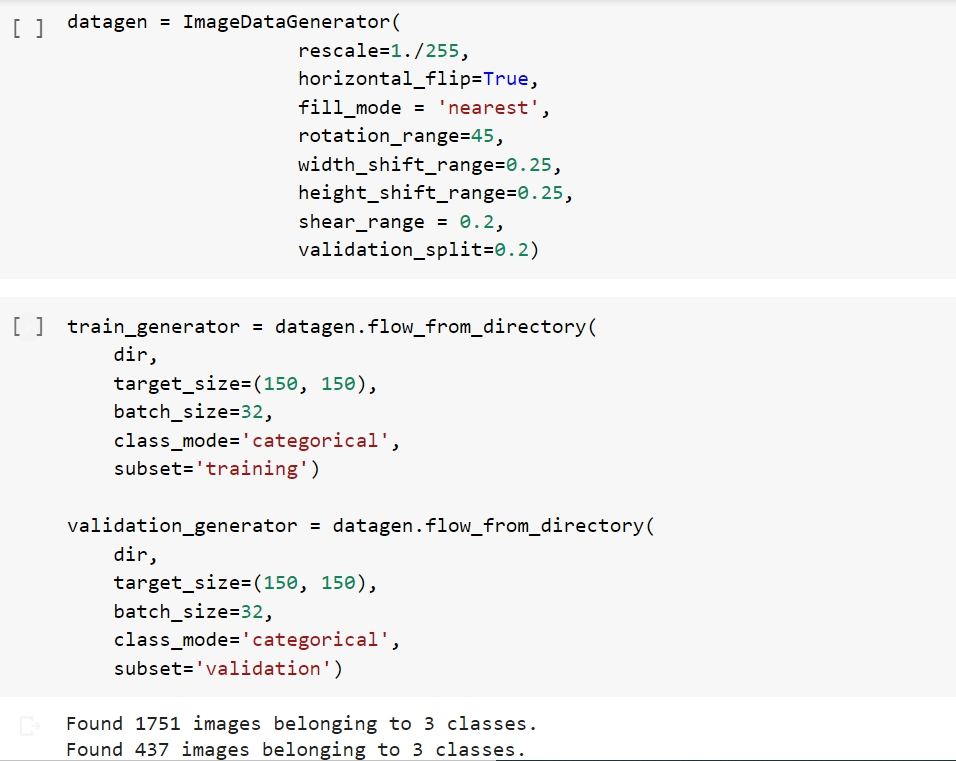
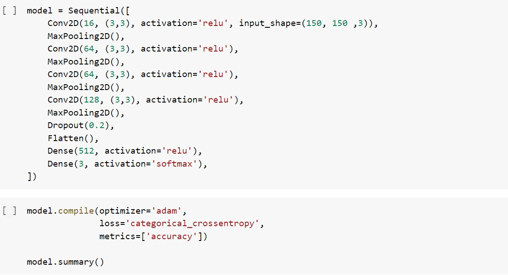
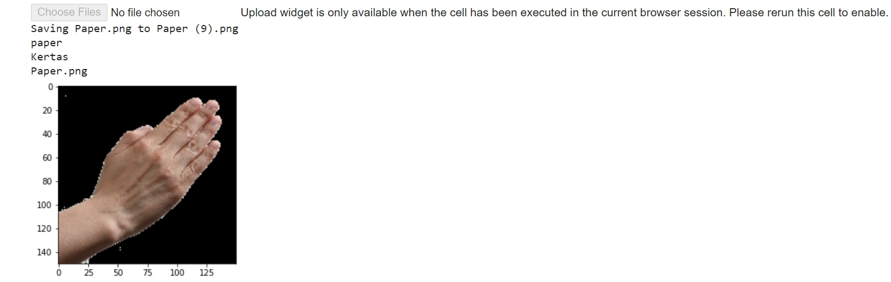

# dscitb
Deskripsi mengenai product dari developers google

Rheco Paradhika Kusuma  
10118065

<h2> Tensorflow </h2>

 Pada kesempatan kali ini akan dibahas mengenai salah satu product dari developers google, yaitu tensorflow.
Tensorflow adalah salah satu framework machine learning open-source yang biasanya digunakan untuk membangun neural network dalam skala besar. Dengan menggunakan kombinasi tensorflow dan keras kita dapat membangun neural network dengan mudah. Kali ini akan dibahas neural network (secara singkat) untuk mengklasifikasi gambar 

<h3> Klasifikasi Gambar </h3>

 Dataset yang akan digunakan adalah data rockpaperscissor, pertama kita import dulu datanya 

  

    
  

Selanjutnya, import package yang akan digunakan

  

    
  

Setelah dataset dan package sudah diimport, kita lakukan preprocessing guna data yang digunakan siap dipakai. Mungkin kalian pernah dengar istilah "garbage in, garbage out" kalau input data yang kita gunakan jelek, maka outputnya pun juga akan jelek. Preprocessing yang dilakukan di sini adalah membagi dataset ke dalam training set dan validation set dan augmentasi gambar

  

    
  

Sekarang setelah data kita siap pakai, maka kita masuk ke bagian membangun model, yaitu neural network dengan beberapa layer

  

    
  

  

    
  

Kita fitting model dan plot accuracy dan loss dari training set dan validation set

  

    
  

  

    
  

 
Model sudah jadi, selanjutnya kita coba model tersebut

  

    
  

Catatan : Code yang digunakan adalah code untuk tugas dicoding kelas " ML untuk pemula" dengan rating bintang 5, namun model ini tidak cukup bagus untuk digunakan dalam klasifikasi (terkadang model salah mengklasifikasi). Perlu adanya revisi sehingga model dapat lebih tepat dalam mengklasifikasi gambar.

<h2> BigQuery </h2>

 Selanjutnya kita akan bahas salah satu product yang berguna dalam menganalisis big data, yaitu BigQuery.
BigQuery adalah analytic database yang didesain untuk membantu pengguna dalam menganalisis data guna mendapatkan insight dan dapat membangun suatu model machine learning dengan menggunakan SQL pada google cloud. Product ini mampu melakukan query dengan efisien dengan biaya yang murah sehingga membantu pengguna untuk menganalisis data dengan sangat cepat, efisien dan hemat biaya.   Cara aksesnya cukup mudah, yaitu buka https://console.cloud.google.com/home/dashboard?project=swift-influence-281305 lalu pada menu navigasi pilih BigQuery. Setelah BigQuery console terbuka, ada kolom Resources yang terletak di kiri bawah, yaitu tempat penyimpanan project yang memuat dataset dan tabel. Selanjutnya kalian gunakan query untuk menganalisis data di BigQuery console. 
Ini salah contoh query yang dapat digunakan di BigQuery :    
  SELECT end_station_name FROM `bigquery-public-data.london_bicycles.cycle_hire`;    
Query ini bertujuan untuk mengambil data dari kolom end_station_name dari google cloud project "public-data bigquery" dataset "london bicycles" dan tabel "cycle hire". Lebih lengkapnya kalian dapat mengikuti JuaraGCP

